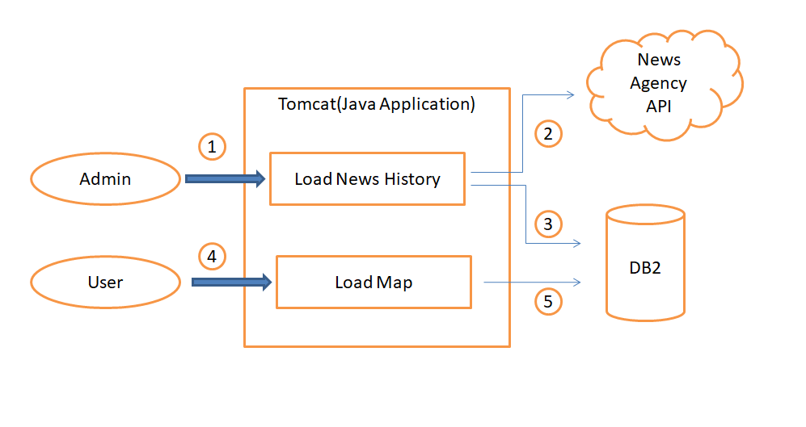

# Disaster_Resiliency
An application for the aid of travellers to show the natural disasters that occurred at a particular place.

## Contents

1. [Short description](#short-description)
1. [The architecture](#the-architecture)
1. [Getting started](#getting-started)


## Short description

### What's the problem?

With the increase in world tourism, number of cross-border travellers has increased around the globe. When a natural disaster hits an area, the tourists suffer the most.

### How can technology help?

It is necessary to make the tourists aware about the climate as well as the history of disasters that occurred at a place over a period of time.

### The idea

It's important to provide the tourists a guide to check the history of natural calamities, its severities, preparations required before making arrangements for the tour. An application with easy-to-search UI with map interface will help them go through various places and their history.

## The architecture



## Getting started

These instructions will get you a copy of the project up and running on your local machine for development purposes. See deployment for notes on how to deploy the project on a live system.

### Prerequisites

What things you need to install the software

* [install java](https://www.oracle.com/in/java/technologies/javase/javase-jdk8-downloads.html)
* [install maven](https://maven.apache.org/install.html)

### Installing

A step by step series of examples that tell you how to get a development env running

Go to the root of the downloaded project in CLI

```bash
>>cd <Root>\Disaster_Resiliency\Disaster-Resiliency
>>mvn spring-boot:run
```

That's it.

Your code is up and running at localhost:8080

## Built with

* [Maven](https://maven.apache.org/) - Dependency management
* [Java](https://www.java.com/en/) - Code logic
* [IBM DB2](https://cloud.ibm.com/catalog?search=db2) - The database used
* [Tomcat](https://tomcat.apache.org/) - Web server

## Authors

* **Ansuman Nayak** - [Infyboys](https://github.com/Infyboys/)
* **Rajesh Nayak** - [rajanhhh](https://github.com/rajanhhh)
